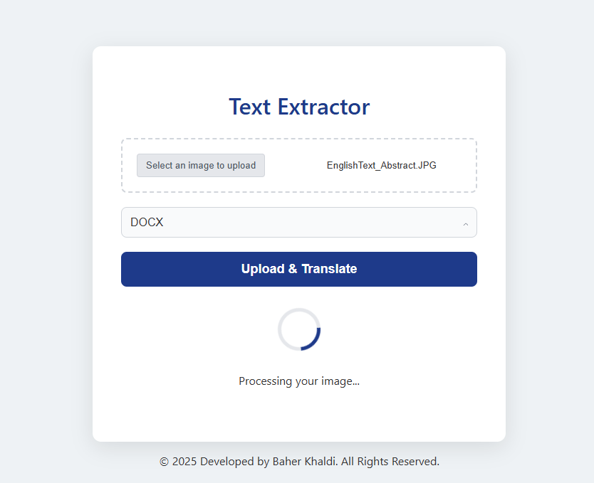

# 🧠 AI Text Extractor

Extract text from images using **Google Gemini AI**, and export it as **PDF** or **DOCX** – all through a sleek, modern web interface.

🔗 **Live Demo**: [aitextextractor-production.up.railway.app](https://aitextextractor-production.up.railway.app)

---

## 🚀 Features

- 🖼️ Upload images with printed or handwritten text
- 🤖 Text extraction using Google Gemini 2.5 Flash
- 📄 Download results as PDF or DOCX
- 🌐 Fully responsive and modern UI
- ⚙️ Backend powered by **Spring Boot**
- 🧰 File generation using **iTextPDF** and **Apache POI**

---

## 📸 How It Works

1. **Upload an image**
2. **Choose output format (PDF or DOCX)**
3. **Click "Upload & Translate"**
4. 🔥 The backend:
   - Sends the image to Gemini AI for OCR
   - Converts the result to the chosen format
   - Returns it for immediate download

---

## 🛠️ Technologies Used

### Backend
- **Spring Boot (Java 17)**
- **Google Gemini API** (via HTTP client)
- **Apache POI** (for DOCX generation)
- **iText 7** (for PDF generation)

### Frontend
- **Vanilla HTML/CSS/JS**
- **Modern UI design**
- **Responsive layout**

---

## 🖥️ Screenshots

| Upload Page | Loading State | Result |
|-------------|---------------|--------|
|  | ⏳ Processing... | ✅ Downloaded file |
---

## 🧪 Local Setup (Development)

### Prerequisites
- Java 17+
- Maven
- Node.js (optional, if you want to bundle frontend separately)
- Gemini API key from [Google AI Studio](https://makersuite.google.com/)

### Steps

```bash
# 1. Clone the repo
git clone https://github.com/your-username/ai-text-extractor.git
cd ai-text-extractor

# 2. Set your Gemini API key
# In src/main/resources/application.properties:
# gemini.api.key=YOUR_GEMINI_KEY

# 3. Run the Spring Boot application
./mvnw spring-boot:run

# 4. Visit
http://localhost:8080

